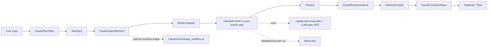
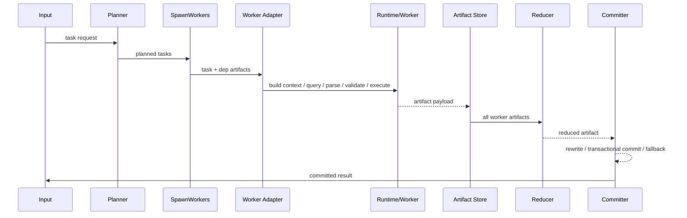
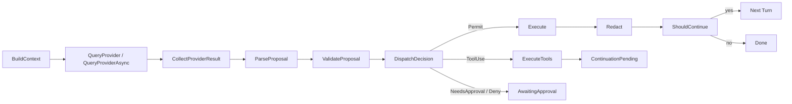

# ClaudeOrchestrator 現状分析と比較レビュー

## エグゼクティブサマリー

添付コードを精読すると、現在の **ClaudeOrchestrator** は、実質的に三層構成です。第一に `ClaudeOrchestrator.wl` が担う **計画・並列実行・集約・コミット** の制御層、第二に `ClaudeRuntime.wl` が担う **単一ターン実行核**、第三に `ClaudeOrchestrator_workflow.wl` が担う **Petri net ベースのワークフロー実行層** です。ここに `claudecode.wl` の **LLMGraph DAG / provider / NBAccess 連携** が下支えとして入り、`documentation.wl` が **refSources / PDF 文脈 / 文献生成** を持つ、という全体像です。コードベースとしては、責務分離の方針自体はかなり明確で、特に「worker は原則 artifact を返すだけ」「notebook への副作用は committer に集約」という設計は一貫しています。

一方で、設計上の強みと同じくらい、運用上のボトルネックも見えます。最大の論点は、**状態がグローバル Association に強く依存していること**、**DAG 並列の一部が論理並列に留まりやすいこと**、**adapter 契約が動的 Association に依存して型安全性が弱いこと**、そして **source / evidence / generated artifact の統一的な台帳がまだ存在しないこと**です。今の構成は「ノートブック上で高い表現力を持つ orchestration runtime」としては優秀ですが、「再起動耐性・外部連携・監査証跡・運用管理」まで含めた基盤としては、まだ中間段階にあります。

公開資料ベースで見ると、urlClaw Codeturn1search0 は **Rust を主実装にした CLI ハーネス / coding runtime**、urlOpenClawturn0search5 は **長寿命 Gateway を中心に、チャネル・セッション・プラグイン・メモリを束ねる personal assistant 基盤** です。したがって比較軸は同一ではありません。ClaudeOrchestrator は **Wolfram Notebook を最終レンダリング対象に持つ notebook-first orchestration**、Claw Code は **coding-agent runtime-first**、OpenClaw は **gateway / session / plugin ecosystem-first** です。つまり、ClaudeOrchestrator の競争力は notebook commit と数式・文書生成の強さにあり、Claw Code / OpenClaw との差は deployment・sandbox・plugin・observability 側に大きく出ています。citeturn2view0turn5search1turn2view3turn7view2turn7view3

**sourcevault** に関しては、現状コードの `documentation.wl` にある `refSources` が「セル単位参照管理」の萌芽を持っている一方で、sourcevault 仕様案はそれを大きく越えて、**Source / Claim / Evidence / DerivedArtifact / WorkflowSupportData を一つの版管理対象に統合する方向**を向いています。ここは非常に妥当です。むしろ現状アーキテクチャを一段成熟させるうえで、sourcevault は周辺機能ではなく、**Orchestrator・Runtime・documentation・workflow を貫く共通データ平面**として扱うべきです。

## 調査対象と評価観点

本レビューは、添付の `claudecode.zip` を展開した上で、主に以下のローカルファイルを読み解いています。

| モジュール | 主な責務 | 代表的な観察点 |
|---|---|---|
| `ClaudeOrchestrator.wl` | plan / spawn / reduce / commit / async orchestration | 4段パイプライン、worker adapter、committer、directives/routing |
| `ClaudeRuntime.wl` | turn 実行核 | phase 分解、approval、retry、tool loop、event trace |
| `ClaudeOrchestrator_workflow.wl` | workflow net / Petri net | token/binding、atomic firing、snapshot、async tick |
| `claudecode.wl` | runtime adapter / provider / DAG infra | `ClaudeBuildRuntimeAdapter`、`LLMGraphDAGCreate`、NBAccess 接続 |
| `documentation.wl` | refSources / PDF 文脈 / bibliography | source 管理の現行ベースライン |
| `Claude Directives` の rules / skills | 実装方針・境界条件 | runtime-orchestrator-boundary、Petri、API error handling など |

比較レビューには、Claw Code と OpenClaw の公開 README / ドキュメント / 公式リファレンスを使用しました。Claw Code については、Rust ワークスペース構成、runtime crate の責務、doctor / state / permissions / container-first workflow、telemetry / parity 文書を中心に確認しています。OpenClaw については、Gateway architecture、plugin internals、memory / memory-wiki、session transcript、security / sandboxing、status / doctor / logs を中心に確認しています。citeturn2view0turn2view1turn5search1turn5search2turn5search3turn2view3turn7view0turn7view2turn7view3turn7view4turn7view5turn8view3turn8view5turn8view6turn9search1turn10view1

評価は、ユーザー指定どおり、**責務分離・モジュール構成・データフロー・インターフェース・依存関係・非同期モデル・エラーハンドリング・セキュリティ/認証・パフォーマンス・拡張性・運用性** を主軸にしています。

## ClaudeOrchestrator の現状アーキテクチャ

現状の最上位フローは `ClaudeRunOrchestration` に非常に素直に現れており、**Plan → Spawn → Reduce → Commit** の四段階です。`ClaudeOrchestrator.wl` の `ClaudeRunOrchestration` は、計画結果を作り、worker を走らせ、artifact を集約し、最後に committer だけが notebook に副作用を書き込みます（`ClaudeOrchestrator.wl` 5858–5940行付近）。

この設計の重要な点は、**worker が notebook を触らない**ことです。`iLLMWorkerAdapterBuilder` は worker を「JSON artifact を返す同期 provider」として構成し、`ExecuteProposal` も実質的には `ArtifactPayload` をそのまま返すだけです。さらに `iValidateWorkerProposal` は worker に対して `NotebookWrite`、`CreateNotebook`、`RunProcess` 等を明示的に拒否します（`ClaudeOrchestrator.wl` 1749–1805行、2445–2579行）。このため、worker は side-effect free な artifact generator に近く、**副作用の集約点を committer に一本化**できています。

一方で committer は逆に、**唯一の副作用実行口**としてかなり厚く作られています。`ClaudeCommitArtifacts` と `iDefaultCommitterAdapterBuilder` は、`ClaudeBuildRuntimeAdapter` をラップしたうえで、`EvaluationNotebook[]` / `CreateNotebook[]` の書換え、shadow buffer を用いた transactional mode、`file_contents` の deterministic export、LLM がセルを書かなかった場合の deterministic fallback まで持っています（`ClaudeOrchestrator.wl` 3863–4285行、5504–5712行）。この部分は、他システムと比較したときの ClaudeOrchestrator の最も独自性が高い層です。

全体アーキテクチャを図示すると、実装上の実態は次のように整理できます。

依存関係としては、**ClaudeOrchestrator → ClaudeRuntime → ClaudeCode/NBAccess** という流れが基本です。さらに workflow 層は `ClaudeRuntimeExecuteTransition` を叩けるため、**workflow は orchestrator の外側にある別系統の制御層ではなく、runtime を呼び出せる上位制御層**として実装されています（`ClaudeOrchestrator_workflow.wl` 1143–1200行）。この構造は後述する sourcevault 設計にも重要で、source/evidence をどの層の所有物にするかを曖昧にしないためには、**control plane と data plane を分離して表現する必要**があります。

## Orchestrator 層の詳細レビュー

### 設計思想と責務

Orchestrator 層の責務はかなり明快です。`ClaudePlanTasks` が task DAG を生成し、`ClaudeSpawnWorkers` が依存解決つきで worker 群を回し、`ClaudeReduceArtifacts` が複数 artifact を統合し、`ClaudeCommitArtifacts` が notebook へ書き込みます。これは「複数 worker の並列サブタスク + 最後に一人だけが書く」という classical map/reduce/commit パターンに近いです。

しかもこの設計は、添付 rules / skills の `runtime-orchestrator-boundary` と整合しています。実装でも workflow 側に「multi-turn / retry / approval / commit ordering は呼び元の Workflow が担う。runtime は 1 turn の純関数的実行核」と明記されており、この境界は設計思想だけではなくコードにも反映されています（`ClaudeOrchestrator_workflow.wl` 1143–1146行）。

### モジュール構成とインターフェース

Orchestrator 層のインターフェースで特徴的なのは、**型定義ではなく Association 契約**で構成されていることです。worker adapter も committer adapter も、`BuildContext` / `QueryProvider` / `ParseProposal` / `ValidateProposal` / `ExecuteProposal` / `RedactResult` / `ShouldContinue` という関数群を持つ Association として渡されます。これは柔軟ですが、同時に **契約破れがコンパイル時ではなく実行時にしか分からない**という弱点があります。

ただし、設計の意図はよく分かります。Wolfram 言語の特性上、Association ベースの adapter は差し替えが容易で、テストスタブも作りやすい。たとえば `iLLMWorkerAdapterBuilder` は output schema を元に JSON retry を掛ける簡易型付き worker を作り、`iDefaultCommitterAdapterBuilder` は base adapter をラップして commit 専用ポリシーを差し込みます。つまり、**静的型の代わりに builder + contract + validation で設計を成立させている**わけです。

### データフロー

worker のデータフローは次の通りです。

ここで重要なのは、**worker の入力が「元入力」ではなく「task + dependency artifacts」に正規化されている**ことです。`iCollectDepArtifactsFromJob` が DAG 内依存を集め、worker prompt builder に渡し、worker はそれを参照した JSON artifact を返します。これにより、各 worker は loosely coupled な DAG ノードとして実行できます。

### 非同期・スレッド・プロセスモデル

この層の並列性は二種類あります。

一つは `LLMGraphDAGCreate` の **sync ノードによる論理並列**です。`iSpawnWorkersDAG` では `maxConcurrency` を設定していますが、コメントでも明示されている通り、これは単一 kernel 内の擬似並列に近く、**CPU 並列 / OS 並列を本質的に保証するものではありません**（`ClaudeOrchestrator.wl` 2991–3104行付近）。

もう一つは `CLIFork` や deferred sync runState による **別プロセス駆動の実並列**です。plan・commit・worker の一部は、CLI / LM Studio / PowerShell / `StartProcess` を用いて subprocess を起動し、DAG tick が完了をポーリングします。`iLaunchPlanPhase` の実装はまさにその形で、`<|"proc"->..., "outFile"->..., "parseFn"->...|>` を返して DAG 側に deferred sync として扱わせています（`ClaudeOrchestrator.wl` 6077–6220行）。この方式は FrontEnd ブロッキング回避には有効ですが、反面、**プロセスの寿命管理・ファイル cleanup・失敗時の再起動戦略が散在しやすい**という課題があります。

### エラーハンドリング

Orchestrator は phase ごとの失敗を比較的明示的に扱っています。`ClaudeRunOrchestration` の最終 status 決定でも、`PlanningFailed`、`SpawnFailed`、`SpawnPartial`、`CommitFailed` が区別されます（`ClaudeOrchestrator.wl` 5920–5939行）。これは運用上よい設計です。

ただし、phase 間の失敗表現はまだ統一されていません。たとえば worker の失敗は artifact 内 `Diagnostics` に入ることもあれば、`SpawnResult["Failures"]` にも入り、commit 失敗は別の status 名になります。sourcevault が導入されるなら、**失敗・再試行・承認・生成物欠落も evidence-rich event として一元表現する**べきです。

### セキュリティと認証

Orchestrator 層で最も良い設計は、**worker 側の副作用禁止と committer 一点集中**です。これは attack surface を明確に狭めています。さらに commit 時にも `CreateNotebook` を deny しつつ rewrite で保険を掛ける二重防御になっています。

ただし、`ClaudeRuntime` 側の判断と組み合わせると、ひとつ重要な弱点があります。runtime では `Deny` 判定が **即失敗ではなく AwaitingApproval に落ちる**ため、最終的に user override できる設計です。これは人間承認型ワークフローとしては現実的ですが、**「絶対 deny」と「承認で override 可能な deny」が混在しやすい**という意味でもあります。Orchestrator 層では policy tier を明示する必要があります。

### パフォーマンス、拡張性、運用性

パフォーマンス上の本質的制約は、**Wolfram kernel + FrontEnd + NotebookObject** という実行環境自体にあります。副作用 commit が notebook に対して行われる以上、完全な stateless backend にはなりません。他方で、この制約の代わりに強い表現力を得ています。

拡張性は、adapter builder と directives/routing hook のおかげで意外に高いです。`iDirectivesAvailableQ`、`A4InjectDirectivePrefix`、role 別 model routing は、role-aware prompt / model resolution を可能にしています（`ClaudeOrchestrator.wl` 7885–8400行付近）。これは OpenClaw の plugin slot ほど制度化されていないものの、**role / model / task hint に基づくポリシー注入点**としてはかなり有用です。

運用性は逆に弱いです。registry はメモリ常駐で、永続化は workflow snapshot など一部に限られます。つまりいまの Orchestrator は **高機能な in-process orchestrator** であって、**長寿命オペレーション基盤**ではありません。

## Runtime 層の詳細レビュー

### 責務と実行モデル

Runtime 層は、`ClaudeRunTurn` と各 `iStep*` 群に非常に明瞭に現れています。実行相は概ね次の順です。

`ClaudeRunTurn` は runtime state を更新し、`iMakeTurnNodes` で phase DAG を作り、`LLMGraphDAGCreate` で turn job を起動します。node category は `rt-context`, `rt-provider`, `rt-collect`, `rt-parse`, `rt-validate`, `rt-dispatch` に分かれ、provider だけが sync/cli 切替対象になります（`ClaudeRuntime.wl` 655–742行付近）。このため Runtime は、**provider のみ非同期化しやすい DAG ベースの state machine** として設計されています。

### データ構造とインターフェース

Runtime の中核状態は `$iClaudeRuntimes[runtimeId]` に保持されます。ここには `Status`, `Phase`, `TurnCount`, `ConversationState`, `LastContextPacket`, `LastProviderResponse`, `LastProposal`, `LastValidationResult`, `LastExecutionResult`, `PendingApproval`, `RetryPolicy`, `EventTrace`, `CompletedDAGJob` などが入ります。`ClaudeRuntimeState` が重いキーを意図的に落としている点からも、設計者が FrontEnd のシリアライズ負荷を強く意識していることが分かります（`ClaudeRuntime.wl` 2049–2080行付近）。

adapter 契約はこの Runtime 層が本丸です。`claudecode.wl` の `ClaudeBuildRuntimeAdapter` は、`NBAccess` を背後に使って `BuildContext`, `QueryProvider`, `ParseProposal`, `ValidateProposal`, `ExecuteProposal`, `RedactResult`, `ShouldContinue` を実装します（`claudecode.wl` 23127行以降）。つまり Runtime は **汎用コアループ**であり、実アプリケーションロジックは adapter に押し出されています。これは非常に拡張しやすい一方、adapter の正しさが runtime 全体の正しさを大きく左右します。

### エラーハンドリングと再試行

Runtime はかなり丁寧に作られています。特に良い点は三つあります。

第一に、**transport retry / format retry / execution retry / validation repair / proposal iterations / tool iterations** が別 budget として管理されていることです。`iConsumeBudget` を通じて phase ごとに消費し、枯渇時は明示的 event を残して停止します。

第二に、**provider error の分類**があり、fatal / retryable を分けて exponential backoff を掛けています。sync provider では `Pause` を避けるなどの枝分かれもあります（`ClaudeRuntime.wl` 765–843行）。

第三に、**repair turn を continuation として構造化**していることです。Parse 失敗や execution 失敗時に、単にエラーを返すのではなく、`ContinuationInput` に repair request を積んで再ターンさせます。これは現実的で、agent 的挙動に合っています。

弱点は、これらの再試行と承認待ちが **in-memory state machine に閉じている** ことです。外部監査・永続 queue・再起動再開の観点では、workflow snapshot のような仕組みが runtime でも必要です。

### セキュリティと認証

Runtime の安全性はかなり高い水準にあります。`ValidateProposal` では、NBAccess の deny/approval heads を見るだけでなく、**AutoEvaluate 禁止パターン**、**core context overwrite 検出**、**PreValidate hook** を組み合わせています（`ClaudeRuntime.wl` 974–1140行）。`ExecuteProposal` は最終的に `NBAccess` の validation / execute / redact を使うため、**実行・秘匿情報 redaction・権限制御の最終責任を NBAccess に寄せる設計**です。

ただし前述の通り、`Deny` が直ちに hard fail ではなく、「ユーザーに詳細を見せ、それでも実行するか判断を仰ぐ」という形で approval 待ちに遷移する点は、厳格運用ではリスクです。Notebook 作業支援としては妥当ですが、**非対話バッチや外部 API 化では hard deny / soft deny の二層化が必要**です。

### ツール実行と continuation

Runtime は code proposal だけでなく `ToolUse` を内包しています。`iToolUseAndContinue` は tool call 群を実行し、結果を `ConversationState` に蓄積し、次ターン用 `ContinuationInput` を作ります。つまり Runtime は、単なる evaluator ではなく **短い tool-augmented dialogue loop** を持っています。

これは Claw Code や OpenClaw との比較で重要です。ClaudeRuntime は tool registry を中心にした ecosystem runtime ではなく、**turn-local な tool mediation を持つ notebook-oriented executor** です。良くも悪くも「小さく閉じた runtime」です。

### Observability と運用性

Runtime には `EventTrace`, `CompletedDAGJob`, `CompletedDAGNodes`, `LastFailure`, `FailureHistory`, `ClaudeTurnTrace`, `ClaudeRuntimeRetry` などがあり、**内部観測性はかなり高い**です。特に job 完了後に DAG 全体を runtime state に保存して後で plot / retry 可能にしているのはよい設計です（`ClaudeRuntime.wl` 1870–1950行付近）。

ただし observability は主に **kernel 内可観測性** に留まります。外部化された構造化ログ、trace correlation、metrics export、SLO、approval audit trail はまだ弱い。ここが Claw Code / OpenClaw との差になります。

## urlClaw Codeturn1search0 と urlOpenClawturn0search5 との比較

Claw Code は、公開 README と Rust workspace 文書を見る限り、**Rust ワークスペースを主実装とする coding-agent runtime** です。`runtime` crate は session persistence、permission policy、MCP lifecycle、system prompt assembly、usage tracking を持ち、`tools` crate は tool execution、`plugins` crate は plugin 管理を担います。`doctor`、`state`、`permission-mode`、container-first workflow、sandbox 検出、telemetry などの表面が非常に揃っています。citeturn2view0turn2view1turn5search1turn5search2turn5search3turn4search2

OpenClaw は対照的に、**単一の長寿命 Gateway が channels / sessions / routing / plugins / memory を束ねる control plane** です。Gateway は WebSocket/HTTP で control UI や nodes を受け、plugin capability model によって provider / tool / channel / memory を in-process で組み込み、session transcript を JSONL で保持し、`status` / `doctor` / `logs` / `security audit` / sandboxing を提供します。Security docs でも明示されている通り、基本思想は hostile multi-tenant ではなく **single trusted operator boundary** です。citeturn2view3turn7view0turn7view2turn7view3turn7view4turn7view5turn8view3turn8view5turn8view6turn9search0turn9search1turn10view1

この前提を踏まえると、比較は次のようになります。

| 観点 | ClaudeOrchestrator | Claw Code | OpenClaw |
|---|---|---|---|
| 設計中心 | notebook 生成・文書/数式成果物 | coding CLI runtime | gateway / session / channel ecosystem |
| Orchestrator 思想 | plan→spawn→reduce→commit、committer 一点書込 | runtime-first、task/team/cron は runtime 拡張として実装 | gateway-first、routing と session が中心 |
| Runtime 境界 | adapter Association + NBAccess 実行核 | Rust crates + permission/tool/session | plugin capability + gateway runtime |
| 副作用モデル | worker 無副作用、committer 専有 | tool 実行を runtime が所掌 | plugins / exec / channels を gateway が所掌 |
| 永続性 | 主に in-memory、workflow は snapshot 可 | session/state/registry をファイル/ランタイムで保持 | transcripts / sessions / config / plugins を継続管理 |
| サンドボックス | NBAccess ポリシー中心、container は限定的 | sandbox 検出・permission mode・workspace boundary が強い | Docker/tool sandbox と security audit が強い |
| プラグイン/API | hook/adapter ベース、非制度化 | plugin crate / MCP-native surfaces | capability model と plugin SDK が明示 |
| observability | EventTrace / DAG 保存 / workflow trace | doctor / JSON diagnostics / telemetry | status / doctor / logs / security audit / OTel |
| 最適用途 | Notebook への高品質コミット | ローカル/CLI coding automation | 常駐 assistant / multi-channel integration |

### 具体的な差分

**Orchestrator 層の設計思想**では、ClaudeOrchestrator は最も強く「成果物生成」に寄っています。worker が artifact を返し、最後に committer が notebook に適用するので、生成物品質と side-effect control に強い。一方 Claw Code は一つの coding runtime としての整合性が強く、多数の slash command、tool registry、permission mode によって **開発者が日常的に使う runtime surface** が熟成しています。OpenClaw はさらに別方向で、agent routing・channel connection・plugin activation が中心であり、ClaudeOrchestrator のような「artifact reduce + notebook commit」は標準モデルではありません。citeturn2view1turn5search1turn2view3turn7view2

**API / プラグインモデル**では、ClaudeOrchestrator は adapter/hook で十分柔軟ですが、制度化・公開契約・互換性保障という観点では最も弱いです。Claw Code は workspace と crate に責務が分かれ、plugin 管理や tool execution の面がより明示的です。OpenClaw はさらに capability registration が整理されており、provider・tool・channel・memory を plugin SDK 経由で登録できます。これは外部エコシステム接続において OpenClaw が最も強いことを意味します。citeturn5search1turn7view2turn7view5

**Runtime 実装**では、ClaudeOrchestrator は `NBAccess` に大きく依存する代わりに notebook/hold expression/Mathematica evaluation という極めて強いドメイン適合性を持ちます。Claw Code は Rust runtime と権限制御、workspace boundary、sandbox 検出、container workflow を持ち、実行基盤としてはより汎用で堅い。OpenClaw は tool sandbox や Docker 境界、browser sandbox、security audit を含むため、「長寿命運用」の実務機能が厚いです。citeturn5search2turn4search2turn8view3turn8view6

**observability** は ClaudeOrchestrator の明確な課題です。内部 trace は良いのですが、外部メトリクスや一貫した診断 CLI は弱い。Claw Code は `doctor` と JSON diagnostics、state ファイル、telemetry crate を持ちます。OpenClaw は `status --all / --deep / --usage`、`doctor`、`logs --follow`、security audit、diagnostics events の OTel export まで見据えています。citeturn2view1turn5search1turn9search1turn10view1turn9search0

### 長所・短所

ClaudeOrchestrator の長所は、**Notebook という出力先に対して一番深い意味論を持っていること**です。単なる text/tool runtime ではなく、cell style、input cell の妥当性、PDF refSources、document generation まで含めて制御できる。これは Claw Code や OpenClaw にはない優位です。

短所は、**runtime / orchestrator / workflow / documentation の境界を横断する 永続メタデータ基盤 が欠けていること**です。だから sourcevault が必要になります。

### Migration / Interop リスク

最も大きい migration リスクは、**データモデルの非互換**です。ClaudeOrchestrator は `HoldComplete`、`NotebookObject`、`TaggingRules`、`NBAccess` の世界に立っています。Claw Code はファイル/CLI/tool/session。OpenClaw は session/transcript/plugin/channel。従って、**そのまま置き換えるのではなく、JSON artifact / MCP / HTTP / sourcevault object を境界に置く**のが現実的です。

主なリスクは次の通りです。

| リスク | 内容 | 推奨対応 |
|---|---|---|
| notebook object 非互換 | `NotebookObject` や `EvaluationNotebook[]` は他 runtime に持ち出せない | commit をローカル service に閉じ込める |
| 承認意味論の差 | ClaudeRuntime は deny も approval 待ちに落とせる | `hard_deny` / `soft_deny` を分ける |
| tool / plugin 契約差 | Association adapter と plugin SDK / tool schema が非互換 | 中間 API を明示 JSON schema 化 |
| 状態永続化差 | in-memory globals と transcript/session store が非互換 | orchestration state を durable store 化 |
| source 管理差 | `refSources` はセルローカル、他は session/store 中心 | sourcevault を共通 data plane にする |

結論として、Claw Code / OpenClaw と **競合する**というより、ClaudeOrchestrator は **別ドメインに最適化された runtime** です。相互運用の最もよい形は、**ClaudeOrchestrator を notebook-side deterministic executor として外部から呼ぶ**ことです。

## sourcevault 設計案の比較

### 現状との関係

添付の `sourcevault-spec(1).md` を読む限り、sourcevault は単なる添付ファイル置き場ではなく、**Source / Claim / Evidence / Derived Artifact / Workflow 支援データを統合するオブジェクト台帳**として考えられています。しかも後半では **Version Governance** として「単一名称で参照される生きているデータ」の扱いまで踏み込んでいます。これは現状コードに不足している層を正しく狙っています。

現行コード側の最も近い前駆体は `documentation.wl` の `refSources` です。ここではセル単位で `{{"filepath.pdf", pages}, ...}` を tagging rule に入れ、PDF 文脈抽出や bibliographic enrichment に使っています。これは「どのセルがどの資料に依存したか」を局所的に表現できますが、**claim 単位の provenance、artifact との因果関係、workflow 実行補助データ、版管理、一貫 ACL** までは持ちません（`documentation.wl` 4531–4674行付近）。

### 比較対象

sourcevault 設計案の比較対象として、ここでは次の三つを採ります。

1. **現行 `documentation.wl` の `refSources` / notebook tagging-rules 方式**  
2. **OpenClaw の memory-core / memory-wiki 方式**  
3. **Git + Git LFS を中心にした file-first repository 方式**  

OpenClaw については、memory-core が plain Markdown を agent workspace に保存し、memory-wiki が structured claims / evidence / contradiction / freshness / dashboards を提供することが公開 docs に明示されています。つまり OpenClaw memory-wiki は、sourcevault に最も近い既存 public system の一つです。citeturn7view4

### 属性比較

| 項目 | sourcevault 設計案 | 現行 `refSources` | OpenClaw memory-core / memory-wiki | Git + Git LFS |
|---|---|---|---|---|
| 主目的 | source/evidence/artifact/workflow の統合台帳 | セル単位の参照資料管理 | 長期記憶 + wiki 的知識整理 | ファイルと履歴の管理 |
| データモデル | object graph 前提、claim/evidence/artifact を分離可能 | notebook cell tagging rules 中心 | Markdown 記憶 + wiki page/claim/evidence | file tree 中心 |
| アクセス制御 | NBAccess と統合しやすい | notebook 権限に従属 | gateway / plugin / session policy に従属 | repo / branch / storage ACL |
| バージョニング | immutable object + mutable alias が望ましい | ほぼ最新版上書き | transcript / memory file / wiki 再構築中心 | commit / branch / merge が強い |
| 検索 | metadata + claim + evidence + text の複合が可能 | セル局所、検索弱い | semantic / wiki 検索が強い | grep / index / 外部検索追加が必要 |
| スケーラビリティ | 実装次第。object store 化できる | notebook に閉じるため弱い | long-lived gateway では扱いやすい | 大規模 file 管理は強い |
| バックアップ/復元 | vault snapshot で一貫性を取れる | notebook 単位バックアップ | workspace/transcript/plugin ごと | git remote + object backup |
| 暗号化 | key reference と object store encryption を設計しやすい | notebook / FS に依存 | host / gateway / plugin 方針依存 | storage backend に依存 |
| 運用コスト | 中程度以上 | 低い | 中程度 | 低〜中 |
| ClaudeOrchestrator との適合 | 非常に高い | 部分的 | 中程度 | 中程度 |

### 評価

**現行 `refSources` 方式**は軽量でよくできています。セルに依存資料をぶら下げるだけなら十分です。しかし、それは sourcevault が目指すものの **小さな一部**に過ぎません。特に弱いのは、**claim と evidence の間の中間層**と、**worker artifact / workflow support data** の管理です。

**OpenClaw memory-core / memory-wiki** は sourcevault に最も近い発想を持っています。memory-core は plain Markdown を明示的メモリとし、memory-wiki は deterministic page structure、structured claims/evidence、contradiction/freshness tracking、generated dashboards、wiki-native tools を持ちます。これは sourcevault の「living data + evidence-oriented governance」にかなり近い方向です。違いは、OpenClaw 側が agent memory / gateway 用に整理されているのに対し、sourcevault は **Notebook / PDF / simulation / workflow artifact** を一体管理したい点です。citeturn7view4

**Git + Git LFS** は版管理と配布では強いですが、claim/evidence graph を native に持ちません。また ACL は repo 単位になりやすく、セル単位・claim単位・artifact 単位ポリシーは別設計が必要です。sourcevault を file-first repo に寄せすぎると、**semantic provenance が commit history に埋もれる**危険があります。

### sourcevault に対する具体的提案

sourcevault は、現状コードと相性のよい最小構成に絞ると、次の四層で始めるのが妥当です。

| 層 | 最小実装 |
|---|---|
| Object ID | immutable `sv://object/<uuid>` |
| Alias | mutable name → current version |
| Edge | `supports`, `derived_from`, `generated_by`, `cites`, `supersedes` |
| Payload | source metadata / claim text / evidence pointer / artifact pointer / workflow aux |

そして少なくとも、以下を別 object type として切り出すべきです。

- **SourceObject**: PDF / URL / notebook attachment / simulation input  
- **ClaimObject**: 文・数式・要約・解釈  
- **EvidenceBundle**: ページ範囲、引用、抽出メタデータ、検証者  
- **DerivedArtifact**: worker/reducer/committer が生成した成果物  
- **WorkflowSupportData**: plan, retry, validation, review, phase diagnostics  

この切り分けをすると、ClaudeOrchestrator 側の「どの worker artifact が、どの source と claim を支えたか」を機械可読に追跡できます。これは現行 `refSources` では不可能で、OpenClaw memory-wiki でも notebook commit との結び付けは弱い部分です。

## 改善提案とロードマップ

### 優先度の高い改善提案

| 優先度 | 提案 | ねらい | 工数 | リスク |
|---|---|---|---|---|
| 高 | runtime / orchestrator / workflow の状態を durable store 化 | 再起動耐性、外部診断、長時間 job 安定化 | 中 | 中 |
| 高 | adapter 契約を公式 schema 化 | builder/hook の破壊的変更防止 | 中 | 低 |
| 高 | `hard_deny` と `soft_deny` を分離 | approval override の意味論を明確化 | 低 | 低 |
| 高 | sourcevault の最小 PoC を `documentation.wl` 置換ではなく並行導入 | 現行 refSources を壊さず provenance を追加 | 中 | 中 |
| 高 | correlation id を導入し、runtime/event/workflow/commit を結ぶ | observability と障害解析の改善 | 低 | 低 |
| 中 | worker artifact を JSON schema + version 付きにする | reducer/committer の互換性安定化 | 中 | 低 |
| 中 | commit を service boundary 化 | OpenClaw / Claw Code との相互運用準備 | 高 | 中 |
| 中 | `file_contents` を sourcevault artifact と結合 | 出力ファイルの provenance 明確化 | 中 | 中 |
| 中 | external metrics / structured logs / OTLP を追加 | 運用性向上 | 中 | 低 |
| 低 | plugin/mcp surface を制度化 | 外部 runtime 連携拡大 | 高 | 中 |

### 短期ロードマップ

短期では、「設計の良さを壊さず、壊れやすい点を減らす」ことに集中すべきです。

| 期間 | 項目 | 内容 | 工数 | リスク |
|---|---|---|---|---|
| 短期 | 標準 state schema | runtime/orchestrator/workflow 状態を共通 key に揃える | 低 | 低 |
| 短期 | 実行相関 ID | plan/spawn/reduce/commit/turn/tool/approval を同一 trace で追う | 低 | 低 |
| 短期 | deny policy tier | `DenyOverride` を policy class で制御 | 低 | 低 |
| 短期 | artifact schema versioning | worker/reducer/commit payload に `SchemaVersion` を入れる | 低 | 低 |
| 短期 | sourcevault PoC | `SourceObject` と `DerivedArtifact` の二種だけ先行実装 | 中 | 中 |

### 中期ロードマップ

中期では、sourcevault を **共通データ平面**に昇格させます。

| 期間 | 項目 | 内容 | 工数 | リスク |
|---|---|---|---|---|
| 中期 | sourcevault object graph | Source / Claim / Evidence / Artifact / WorkflowSupportData を導入 | 高 | 中 |
| 中期 | durable orchestration registry | globals からファイル/DB ベースへ移行 | 高 | 中 |
| 中期 | commit service 化 | notebook commit を外部呼出可能な境界にする | 高 | 高 |
| 中期 | observability stack | JSON logs、metrics、approval audit、failure taxonomy 統合 | 中 | 低 |
| 中期 | interop API | Claw Code / OpenClaw から呼べる MCP/HTTP tool surface を定義 | 中 | 中 |

### 長期ロードマップ

長期では、ClaudeOrchestrator を「notebook 特化アプリ」から「notebook を持つ execution backend」へ引き上げます。

| 期間 | 項目 | 内容 | 工数 | リスク |
|---|---|---|---|---|
| 長期 | multi-runtime backend | NBAccess backend と CLI/backend を並立 | 高 | 高 |
| 長期 | policy engine 外部化 | approval / deny / source access / export policy を外出し | 高 | 高 |
| 長期 | sourcevault search 平面 | metadata + full text + claim/evidence graph + vector を統合 | 高 | 中 |
| 長期 | replay / audit / reproducibility | artifact から commit 再現、workflow 再生、証跡監査を実現 | 高 | 中 |

### 推奨する実装順序

最も現実的な順序は以下です。

1. **state schema / correlation id / hard-vs-soft deny**  
2. **artifact schema versioning / sourcevault PoC**  
3. **durable registry / approval audit / structured logs**  
4. **commit service boundary / interop API**  
5. **sourcevault full graph / replayability**

この順序にすると、現状の notebook-first 価値を保ちながら、Claw Code / OpenClaw 流の運用性と接続性を段階的に吸収できます。

### Open questions / limitations

本レビューで最も大きい未解決点は、**sourcevault の物理実装を notebook tagging rules にどこまで残すか**、それとも **完全に notebook 外の object store に寄せるか**です。私の結論は後者寄りですが、UI 体験の一貫性を考えると notebook 側キャッシュは必要です。

また、現状コードは十分に設計されている一方で、**性能特性の実測値**まではこの場でベンチマークしていません。したがって、並列性・DAG 完了時間・commit retry の最適値は、実運用ワークロードでの計測が必要です。

最後に、Claw Code / OpenClaw との比較は公開資料ベースです。公開 docs から見える設計思想と表面積は十分比較できますが、内部の未公開実装詳細までは踏み込んでいません。その前提でもなお、結論はかなりはっきりしています。**ClaudeOrchestrator は notebook-native な成果物生成系として非常に強いが、sourcevault と durable observability を持たない限り、システム基盤としてはまだ完成形ではない**。逆に言えば、そこで sourcevault を中心に再整理すると、このコードベースはかなり強い基盤になります。